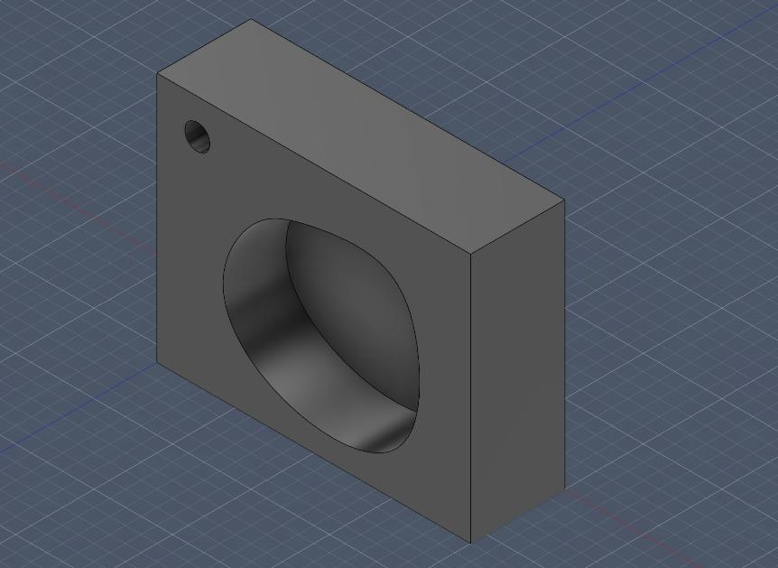

# CNC Milling Project: 3D Model and G-code Machining Program

Final project for the course *Prototyping of Structures Using 3D Printing and CNC Techniques* (PK3D), AGH University of Krakow, WEAIiIB.
Maria Malinka, Group 3, May 2026.

A steel block (100 × 80 × 30 mm) with a central pocket, a machined outer contour and a drilled hole was designed in Autodesk Fusion. The CAM toolpaths were then post-processed into a single G-code program for a 3-axis CNC mill.

## Repository contents

| Path | Description |
|------|-------------|
| [`gcode/1001.nc`](gcode/1001.nc) | Complete G-code program (program 1001, 11,101 lines, blocks N10–N55455) |
| [`report_EN.pdf`](docs/PK3D_Grupa3_Maria_Malinka_EN.pdf) | Report as a PDF |
| [`docs/images/`](docs/images/) | Figures from the report (model, sketch, toolpath screenshots) |

## Part

| Property | Value |
|----------|-------|
| Stock / part size | 100 × 80 × 30 mm |
| Material | Steel |
| Features | Central pocket (20 mm deep), outer contour, Ø8 mm through-hole |
| Work offset | G54 |
| Units | mm (G21), absolute (G90), feed in mm/min (G94) |

## Tools

| Tool | Type | Diameter | Used for | Length offset |
|------|------|----------|----------|---------------|
| T1 | Flat end mill | 10 mm | Face milling | H1 |
| T2 | Flat end mill | 6 mm | Pocket and contours | H2 |
| T3 | Twist drill, 118° point | 8 mm | Drilling | H3 |

## Operation sequence

| # | Operation (Fusion name) | Tool | Starts at block | Notes |
|---|-------------------------|------|-----------------|-------|
| 1 | Face2 | T1 | N25 | 1 mm facing pass, arc lead-in/lead-out in the XZ plane (G18) |
| 2 | 2D Pocket1 | T2 | N355 | Helical ramp entry, multiple step-downs to about Z-20.5 |
| 3 | 2D Contour3 | T2 | N53890 | Contour pass along the pocket wall |
| 4 | 2D Contour1 | T2 | N55250 | Outer profile down to Z-31, with arc lead-in/lead-out |
| 5 | Drill1 | T3 | N55380 | G81 canned cycle at X-37.056 Y28.855, Z-31, R4 |

The program pauses with an optional stop (M1) before each tool change after the first one, and ends with M30.

## Cutting parameters

| Parameter | Value |
|-----------|-------|
| Spindle speed | S5000 rpm |
| Cutting feed | F1000 mm/min |
| Plunge / ramp feed | F333.33 mm/min |
| Coolant | On (M8) for every operation |

Cutting speed: Vc ≈ 157 m/min for T1 and ≈ 94.2 m/min for T2.
Feed per tooth for a 2-flute cutter: fz = 1000 / (2 · 5000) = 0.1 mm/tooth.

## Running the program

1. Load `gcode/1001.nc` into the machine controller or a G-code simulator (e.g. NC Viewer, CAMotics).
2. Set the G54 work offset: the program's X0 Y0 is at the centre of the block and Z0 is on the top of the stock (the facing pass removes 1 mm).
3. Measure the tool lengths into offsets H1–H3 for T1–T3.
4. Simulate or dry-run before cutting, because the program was generated for a course project and has not been tested on a specific machine.

## Tools used

- Autodesk Fusion (CAD modelling and CAM toolpaths)
- Fusion post-processor (G-code generation)
